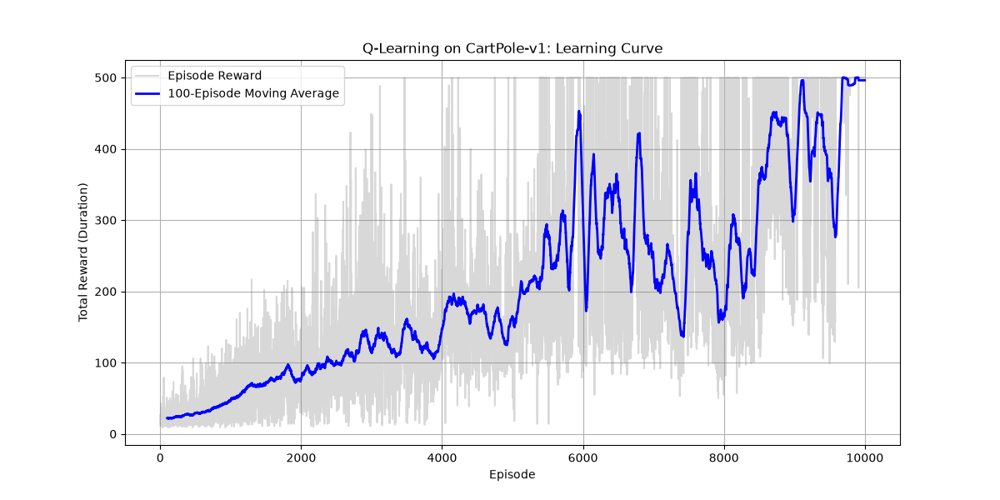

# RL Fundamentals: CartPole & Q-Learning

Hi! I built this small project to get some hands-on experience with Reinforcement Learning before heading into interviews. 

My goal was to implement a Q-Learning agent from scratch and use it to solve the CartPole environment. I intentionally avoided using high-level RL libraries like stable-baselines3 because I really wanted to understand what's actually happening inside the algorithm rather than just calling a train function.

## What is this project?

This repo contains a basic, from-scratch Python implementation of tabular Q-Learning. The agent learns how to balance a pole on a moving cart through trial and error. 

## The CartPole Environment

CartPole is pretty simple: the agent controls a cart and can move it either left or right. The goal is to keep the pole balanced on top of the cart for as long as possible.

At every step, the environment gives the agent some numbers to tell it what's going on:
- Cart position
- Cart velocity
- Pole angle
- Pole angular velocity

The agent's action is just choosing left or right. It gets a reward for every step the pole stays upright.

## How Q-Learning works here

### Discretization
Those four numbers from the environment (like position and velocity) are continuous. Since I wanted to use a simple Q-table, I had to convert these continuous numbers into discrete bins. It's basically like grouping a range of angles into a single bucket so the table doesn't have to be infinitely large.

### The Q-table and Bellman Update
The Q-table is literally just a big grid that stores the expected value of taking a certain action in a particular state. 

After the agent takes an action and gets a reward, it updates its Q-table using the Bellman equation:
`Q(s,a) = Q(s,a) + α [r + γ max Q(s',a') - Q(s,a)]`

To break that down:
- `s` is the current state, `a` is the action taken.
- `r` is the reward received.
- `s'` is the next state.
- `α` (alpha) is the learning rate, which controls how much new information overrides old information.
- `γ` (gamma) is the discount factor, which determines how much the agent cares about future rewards versus immediate ones.

The equation just says: take my old estimate, look at the reward I just got plus the best possible outcome from the new state, and adjust my estimate a little bit.

## Epsilon-Greedy Exploration

At the beginning, the agent doesn't know anything, so it needs to try different actions to see what works. I used an epsilon-greedy strategy for this. 

Basically, the agent sometimes chooses a random action (exploration) and sometimes chooses the action that the Q-table thinks is best (exploitation). The `epsilon` value controls this. It starts really high (mostly random actions) and gradually decreases over time. This means the agent explores a lot at the start, and then relies more on what it has learned as training goes on.

## Results

Here is the learning curve generated by the training script:



The reward curve shows the total reward the agent got in each episode. The early episodes are pretty bad because the agent is mostly just guessing and exploring. But as training progresses, you can see the rewards generally go up as the Q-table learns useful values. It gets a bit noisy, but the overall trend shows that it figured out how to balance the pole.

## Running the project

If you want to try it out yourself, you just need Python installed. 

```bash
pip install -r requirements.txt
python train.py
```
This will run the training loop and save a new `learning_curve.png` in the folder.

## Project Structure

- `train.py`: The main script with the Q-Learning loop, discretization, and plotting.
- `requirements.txt`: Python dependencies (gymnasium, numpy, matplotlib).
- `README.md`: This file.
- `index.html`: A static webpage version of this README.
- `learning_curve.png`: The plot generated after training.

## What I learned

Building this helped me actually understand:
- How Q-Learning works under the hood
- Why state discretization is necessary for tabular methods
- How to balance exploration vs exploitation using epsilon decay
- How Q-table updates actually work with the Bellman equation
- The limitations of tabular Q-Learning (it gets really hard to use if you have too many states)

## Limitations / Next Steps

Tabular Q-Learning is great for learning, but it has limits. Realistic next steps for this project would be:
- Tuning the hyperparameters (like learning rate or epsilon decay) to see if it learns faster
- Trying different discretization strategies (like uneven bins)
- Comparing this simple approach with a Deep Q-Network (DQN)
- Experimenting with other Gymnasium environments

Check out the repo here: [https://github.com/shivakuppili06/RL-Fundamentals](https://github.com/shivakuppili06/RL-Fundamentals)
